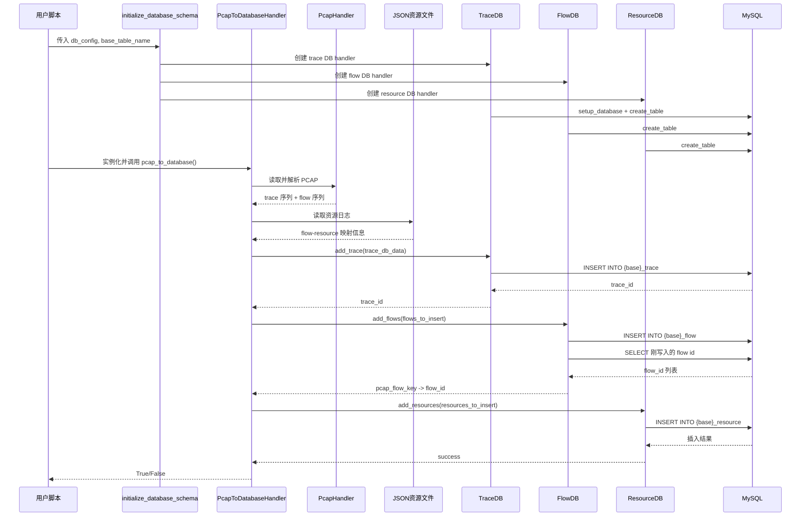

# 1. 项目一句话概述
`pypcaptools` 是一个面向离线网络流量分析的 Python 工具库，核心职责是把 `pcap` 抓包文件解析为 trace/flow 序列，并可结合同名或关联的 `json` 资源日志，将结构化结果写入 MySQL。

已确认它不是常驻服务，而是“库 + 示例脚本”的离线处理形态；主使用方式是由调用方在 Python 中实例化 `PcapHandler` 或 `PcapToDatabaseHandler` 来执行解析、入库、查询。

# 2. 项目整体结构总结
- 核心功能
  - 解析 `pcap` 中的网络包，抽取整包序列 `trace` 和按五元组切分的 `flow`
  - 将流量序列写入 MySQL 三层表结构：`trace`、`flow`、`resource`
  - 可读取外部 `json` 资源日志，把 URL、状态码、内容类型、资源大小等应用层信息映射到 flow/resource
  - 提供查询封装 `TraceInfo`、`FlowInfo`、`ResourceInfo` 用于从数据库反查序列和统计信息
- 运行方式
  - 典型入口是 Python 脚本调用 `initialize_database_schema()` 和 `PcapToDatabaseHandler.pcap_to_database()`
  - 也可以单独调用 `PcapHandler.get_trace_sequence()` / `get_flow_sequences()` 只做解析不入库
  - 查询侧通过 `TraceInfo` / `FlowInfo` / `ResourceInfo` 连接 MySQL 后执行条件查询
- 技术栈
  - Python 3.8+
  - `dpkt` 负责 PCAP 解析
  - `mysql-connector-python` 负责 MySQL 连接与 SQL 执行
  - `scapy` 在依赖里声明了，但当前主链路代码实际主要使用 `dpkt`
- 外部依赖
  - MySQL 数据库
  - 输入侧依赖本地 `pcap` 文件
  - 可选依赖本地 `json` 资源日志文件
- 主要输入输出
  - 输入：`pcap` 文件、可选 `json` 资源文件、数据库连接参数、表名前缀、业务元信息
  - 输出：MySQL 中 `{base}_trace`、`{base}_flow`、`{base}_resource` 三张表
  - 查询输出：流量统计结果、序列列表、按 trace 聚合后的 Flow 对象

# 3. 核心模块划分
| 模块名 | 路径 | 作用 | 上游依赖 | 下游依赖 | 重要程度 |
|---|---|---|---|---|---|
| 包公开入口 | `src/pypcaptools/__init__.py` | 对外暴露 `PcapHandler`、`PcapToDatabaseHandler`、`initialize_database_schema` | 用户脚本 | `pcaphandler.py`、`pcaptodatabasehandler.py` | 高 |
| PCAP 解析器 | `src/pypcaptools/pcaphandler.py` | 读取 `pcap`，识别本机 IP，生成 trace 序列和 flow 序列 | `dpkt`、本地 `pcap` | `PcapToDatabaseHandler` 或用户脚本 | 最高 |
| 入库编排器 | `src/pypcaptools/pcaptodatabasehandler.py` | 继承 `PcapHandler`，组织解析、JSON 关联、三张表写入 | `PcapHandler`、`TraceDB`、`FlowDB`、`ResourceDB`、本地 `json`、MySQL | 三层表写入链路 | 最高 |
| 数据库基类 | `src/pypcaptools/TrafficDB/TrafficDB.py` | 封装 MySQL 连接、上下文管理、基础 query/commit | `mysql.connector` | `TraceDB`、`FlowDB`、`ResourceDB` | 高 |
| Trace 表适配器 | `src/pypcaptools/TrafficDB/TraceDB.py` | 创建 trace 表并插入 trace 主记录 | `TrafficDB` | `{base}_trace` | 高 |
| Flow 表适配器 | `src/pypcaptools/TrafficDB/FlowDB.py` | 创建 flow 表并批量插入 flow 记录 | `TrafficDB`、trace 外键 | `{base}_flow` | 高 |
| Resource 表适配器 | `src/pypcaptools/TrafficDB/ResourceDB.py` | 创建 resource 表并批量插入资源记录 | `TrafficDB`、flow 外键 | `{base}_resource` | 高 |
| 查询抽象基类 | `src/pypcaptools/TrafficInfo/TrafficInfo.py` | 条件表达式转 SQL，统一封装查询动作 | `TrafficDB` 子类实例 | `TraceInfo`、`FlowInfo`、`ResourceInfo` | 中 |
| Trace 查询层 | `src/pypcaptools/TrafficInfo/TraceInfo.py` | 查询 trace，并把 flow 序列重构成 `Flow` 对象 | `TrafficInfo`、`TraceDB`、`Flow` | 用户分析脚本 | 中 |
| Flow/Packet 数据对象 | `src/pypcaptools/Flow.py`、`src/pypcaptools/Packet.py` | 用对象形式表达流和包，供查询结果重建使用 | 查询层 | 用户分析逻辑 | 中 |
| 示例脚本 | `examples/*.py` | 展示典型调用方式 | 公开 API | 用户理解项目的最短路径 | 高 |

# 4. 主执行流程
步骤 1：调用方准备 `db_config`、`base_table_name`、`input_pcap_file`，可选再提供 `input_json_file`、`protocol`、`accessed_website`、`collection_machine`。

步骤 2：调用 `initialize_database_schema(db_config, base_table_name)`。

步骤 3：该函数基于 `base_table_name` 生成三张表名：
- `{base}_trace`
- `{base}_flow`
- `{base}_resource`

步骤 4：函数分别实例化 `TraceDB`、`FlowDB`、`ResourceDB`，连接 MySQL，必要时创建数据库，再创建三张表和外键关系。

步骤 5：调用方实例化 `PcapToDatabaseHandler(...)`，其构造函数先调用父类 `PcapHandler.__init__()`。

步骤 6：`PcapHandler` 读取 `pcap` 文件，使用 `dpkt.pcap.Reader` 逐包解析，只保留可识别的 IP/TCP 包，形成轻量级包列表 `self.packets`。

步骤 7：`PcapHandler` 根据捕获到的第一个 IP 包源地址推断 `local_ip`，后续用于判断方向。

步骤 8：调用 `pcap_to_database()` 后，先校验 `pcap` 是否有效；如果提供了 `json` 路径且文件存在，则加载 JSON 资源信息。

步骤 9：调用 `get_trace_sequence()`，把整个 PCAP 聚合成 trace 级别序列：
- `timestamps_seq`
- `payload_seq`
- `direction_seq`
- `capture_time`
- `total_packet_count`

步骤 10：调用 `get_flow_sequences()`，把包按五元组归并成 flow，生成每个 flow 的：
- 源/目的 IP 和端口
- 传输层协议
- `flow_start_time_ms`
- `flow_duration_ms`
- `timestamps_seq`
- `payload_seq`
- `direction_seq`
- `trace_packet_indices`

步骤 11：构造 trace 数据字典，先写入 `{base}_trace`，获得 `trace_id`。

步骤 12：如果存在 JSON，则对 JSON 中每条 flow 记录进行匹配：
- 从 JSON key 中解析两端 IP:Port
- 按同样规则构造可能的 `pcap_flow_key`
- 在 `flows_pcap_data` 中找到对应 flow
- 把 JSON 中的 `sni`、`resources` 合并到 flow 上下文

步骤 13：批量写入 `{base}_flow`，再回查刚写入的 flow 记录，把数据库 `flow_id` 回填到内存中的 `flow_id_map`。

步骤 14：遍历每个 flow 对应的 JSON `resources`：
- 过滤不完整资源
- 根据 `response_packet_nums` 和 flow 时间轴估算资源响应开始/结束时间
- 若 JSON 已给绝对时间戳，则优先用 JSON 时间
- 构造 resource 行数据

步骤 15：批量写入 `{base}_resource`。

步骤 16：如果没有 JSON，则跳过 resource，仅把全部解析出的 flow 写入 `{base}_flow`。

步骤 17：后续若需要分析，则调用 `TraceInfo`、`FlowInfo`、`ResourceInfo` 连库查询；其中 `TraceInfo.get_trace_flow()` 会把数据库中的序列重建为 `Flow(Packet...)` 对象。

# 5. 架构图绘制要素
## 节点列表
- 用户脚本/示例：准备参数并触发解析或查询
- Schema 初始化器：创建数据库和三张表结构
- PcapToDatabaseHandler：总编排器，负责解析、关联、入库
- PcapHandler：PCAP 解析内核，生成 trace/flow 序列
- JSON Resource Log：可选的应用层资源日志输入
- TraceDB/FlowDB/ResourceDB：数据库访问层
- MySQL Trace 表：保存一次完整抓包的主记录
- MySQL Flow 表：保存 trace 下拆分出的网络流
- MySQL Resource 表：保存 flow 下关联的资源级标签
- TrafficInfo 查询层：面向分析脚本的查询/重构入口

## 连接关系
- 用户脚本/示例 --> Schema 初始化器：先初始化数据库和三张表
- 用户脚本/示例 --> PcapToDatabaseHandler：传入 pcap/json 路径和业务参数
- PcapToDatabaseHandler --> PcapHandler：复用底层 PCAP 解析能力
- PcapHandler --> PcapToDatabaseHandler：返回 trace 序列和 flow 序列
- JSON Resource Log --> PcapToDatabaseHandler：提供资源级元数据和 flow 匹配信息
- PcapToDatabaseHandler --> TraceDB/FlowDB/ResourceDB：执行三层入库
- TraceDB/FlowDB/ResourceDB --> MySQL Trace 表/Flow 表/Resource 表：持久化结构化结果
- TrafficInfo 查询层 --> TraceDB/FlowDB/ResourceDB：从数据库读取统计和序列
- TrafficInfo 查询层 --> 用户脚本/示例：返回列表、统计值、Flow 对象

# 6. Mermaid 架构图代码
```mermaid
flowchart TD
    U[用户脚本 / Examples] --> S[initialize_database_schema]
    U --> H[PcapToDatabaseHandler]
    P[PCAP 文件] --> PH[PcapHandler]
    J[JSON 资源日志] --> H
    H --> PH
    PH --> TSEQ[Trace 序列]
    PH --> FSEQ[Flow 序列]
    TSEQ --> H
    FSEQ --> H
    S --> DBL[TraceDB / FlowDB / ResourceDB]
    H --> DBL
    DBL --> MT[(MySQL: {base}_trace)]
    DBL --> MF[(MySQL: {base}_flow)]
    DBL --> MR[(MySQL: {base}_resource)]
    Q[TraceInfo / FlowInfo / ResourceInfo] --> DBL
    DBL --> QOUT[统计结果 / 序列 / Flow对象]
```

# 7. Mermaid 时序图代码


# 8. 可直接给绘图模型/设计模型使用的配图描述
请绘制一张专业、简洁、工程化的 Python 离线流量处理系统架构图，主题是“PCAP 解析与三层数据库入库”。采用自上而下布局，左侧放输入源，中央放处理编排和解析模块，右侧放 MySQL 存储层，下方放查询分析层。输入源包含 `PCAP 文件` 和 `JSON 资源日志`；中央模块包含 `用户脚本/Examples`、`Schema 初始化器`、`PcapToDatabaseHandler`、`PcapHandler`、`TraceDB/FlowDB/ResourceDB`；存储层包含三张有关联关系的表：`{base}_trace`、`{base}_flow`、`{base}_resource`，其中 trace 指向 flow，flow 指向 resource；底部包含 `TraceInfo / FlowInfo / ResourceInfo` 查询层，表示从 MySQL 回读统计和序列数据。箭头要明确区分“控制调用”和“数据流”，主链路突出为：用户脚本 -> 初始化/处理器 -> PCAP解析 -> trace/flow 序列 -> 数据库写入 -> 查询分析。整体风格适合论文系统图、技术方案图或 draw.io/PPT 二次加工，配色克制，层次清晰，标签使用中文加英文模块名混排。

# 9. 最值得看的文件
- `README.md`：最快理解项目定位、三层表设计和标准使用姿势
- `src/pypcaptools/__init__.py`：确认项目真正公开暴露的 API 很少，入口非常集中
- `src/pypcaptools/pcaptodatabasehandler.py`：整个项目最核心的编排文件，包含初始化、PCAP/JSON 融合、三层入库主流程
- `src/pypcaptools/pcaphandler.py`：PCAP 解析核心，决定 trace/flow 是如何从抓包中提取出来的
- `src/pypcaptools/TrafficDB/TrafficDB.py`：理解数据库访问层抽象、连接方式和事务边界
- `src/pypcaptools/TrafficDB/TraceDB.py`：理解 trace 表字段设计和 trace 主记录写入方式
- `src/pypcaptools/TrafficDB/FlowDB.py`：理解 flow 表字段、trace 外键和批量插入逻辑
- `src/pypcaptools/TrafficDB/ResourceDB.py`：理解 resource 表字段、flow 外键和资源标签写入逻辑
- `src/pypcaptools/TrafficInfo/TraceInfo.py`：理解查询分析层如何把数据库中的序列重构为 `Flow` 对象
- `examples/pcap_to_database.py`：理解标准调用方式的最短样例

# 附：已确认的实现偏差与画图注意点
- 已确认：当前 `PcapHandler` 实际只保留 `IP + TCP` 包，虽然文件注释和部分 README/示例会提到 UDP 或更泛化的 flow 概念；画主图时应以“当前实现主链路是 TCP”为准。
- 已确认：示例 `examples/split_flow.py` 中调用了 `split_flow()`，但当前 `pcaphandler.py` 中并没有这个方法；这是旧示例残留，不应画进当前主链路。
- 已确认：示例 `examples/flow_to_database.py` 调用了 `flow_to_database()`，但当前 `PcapToDatabaseHandler` 实现中没有这个方法；主流程应画 `pcap_to_database()`。
- 已确认：查询层 `TrafficInfo.table_columns()` 依赖 `get_table_columns()`，但 `TrafficDB` 基类中未实现该方法；因此查询层结构可以画，但不要把“表头查询能力”当作完全可靠的已落地能力。
- 推测：`FlowInfo`/`ResourceInfo` 的表名使用方式存在不一致，查询链路整体思路明确，但部分示例和实现细节仍有演进中痕迹。
